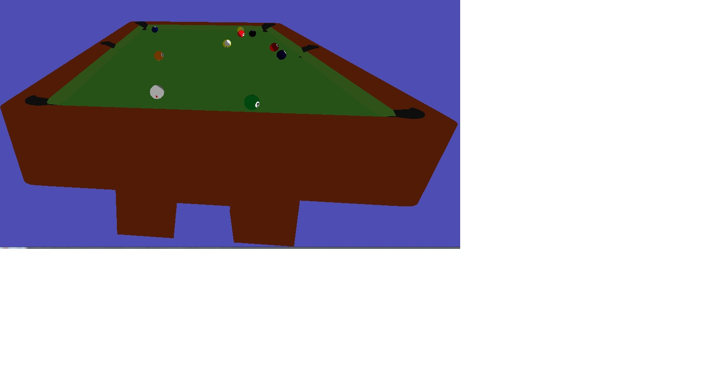
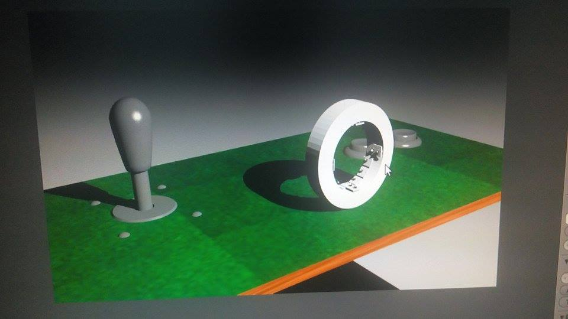
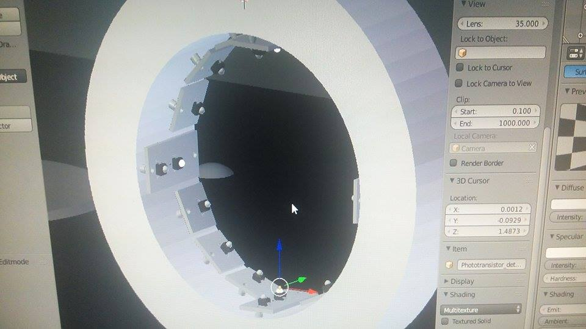
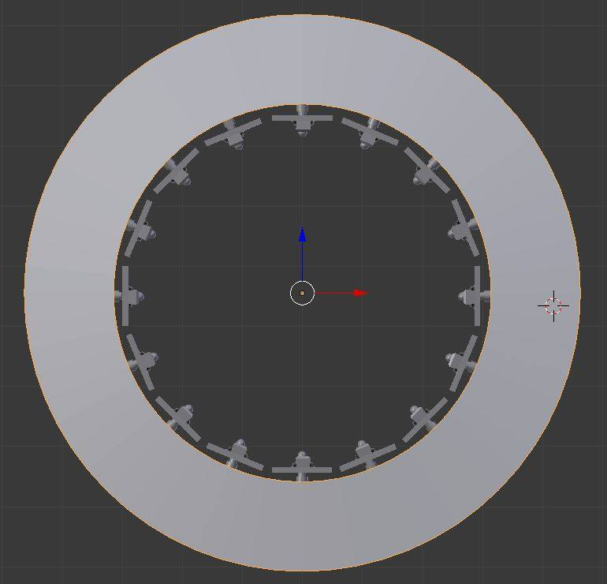
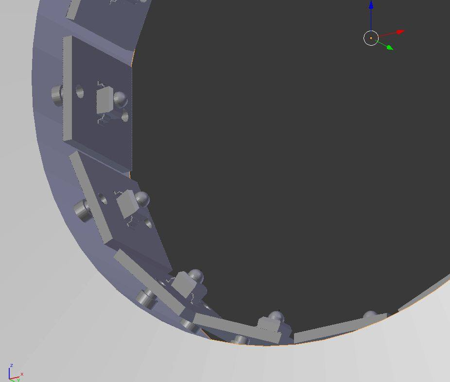
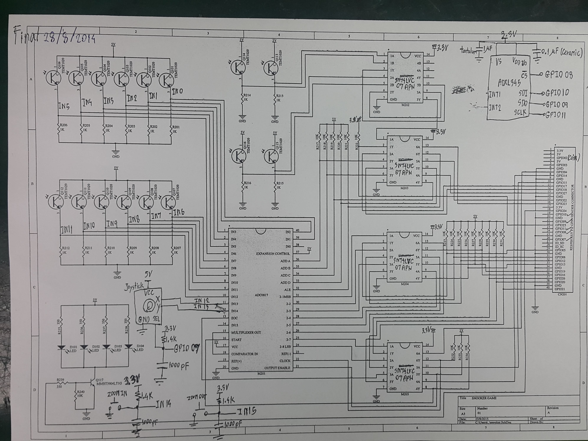

RaspBillard
====================
The RaspBilliard is Low-cost Virtual Realistic Billiard Simulator, 
running on Raspberry Pi

[RaspBilliard video](https://www.youtube.com/watch?v=DKvyWfxoGeY)

Acknowledgements
====================
Development of this project would not have been possible without following document and library. 

1.  AN EVENT-BASED POOL PHYSICS SIMULATOR http://web.stanford.edu/group/billiards/AnEventBasedPoolPhysicsSimulator.pdf  

2.  POOL PHYSICS SIMULATION BY EVENT PREDICTION II: COLLISIONS http://web.stanford.edu/group/billiards/PoolPhysicsSimulationByEventPrediction2Collisions.pdf  

3.  pi3d <https://github.com/tipam/pi3d>  

Dependencies
====================
- pi3d
- numpy
- cython

Usage
====================
Camera movement and aimming

- key 'w' move camera up
- key 's' move camera down
- key 'a' move camera left
- key 'd' move camera right
- key 'i' zoom in
- key 'o' zoom out

To increase/decrease Cue stick velocity

- key 'k' increae velocity of cue stick
- key 'l' decrease velocity of cue stick

To make English (side spin)

- key 'left' to make the ball slide right
- key 'right' to make the ball slide left

To make top and back spin

- key 'up' for top spin
- key 'down' for back spin

To make curve/masse shots

- key 'u' to elevate cue stick up (increase angle of cuestick)
- key 'j' to elevate cue stick down (decrease angle of cuestick)

To Make a shot and aimming

- key 'f' to create aiming line
- key 'g' to make a shot

Concept Overview
====================
The arcade machine/simulator will consist of accelerometer and infrared sensor to measure,

- How fast is the cue ball collided with the cue stick (m/s)
- The Angle that the cue stick is elevated (0-90 degress)
- The position of impact on the cue ball (Cue-Ball impact)

   

   

   

   

   

   
Thank you Mr. Theeraphan Upan, he help me write this schemetic. And he will make PCB soon.

